# Keruberosu アーキテクチャ図

このドキュメントでは、Keruberosu のアーキテクチャを視覚的に示します。

## 目次

1. [システム全体構成](#システム全体構成)
2. [レイヤーアーキテクチャ](#レイヤーアーキテクチャ)
3. [認可エンジンの処理フロー](#認可エンジンの処理フロー)
4. [DSL パーサーの処理フロー](#dslパーサーの処理フロー)
5. [データフロー](#データフロー)

---

## システム全体構成

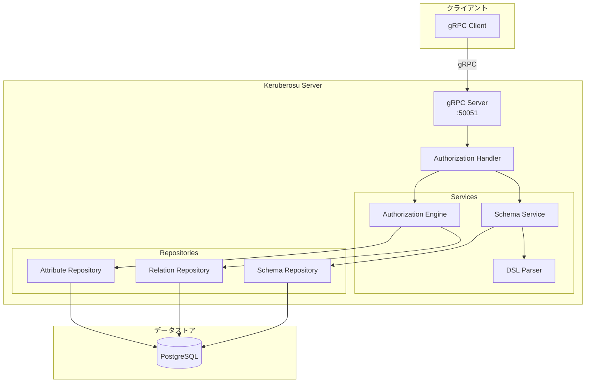

---

## レイヤーアーキテクチャ

Keruberosu は 4 層のクリーンアーキテクチャを採用しています。

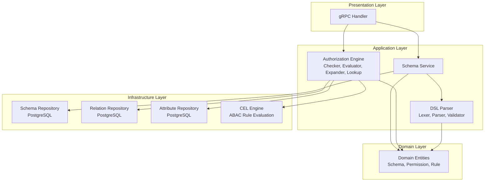

**各層の責務:**

| Layer              | 責務                           | 主要コンポーネント                 |
| ------------------ | ------------------------------ | ---------------------------------- |
| **Presentation**   | gRPC リクエスト/レスポンス処理 | `handlers/`                        |
| **Application**    | ビジネスロジック、パース処理   | `services/`                        |
| **Domain**         | ドメインモデル定義             | `entities/`                        |
| **Infrastructure** | データアクセス、外部サービス   | `repositories/`, `infrastructure/` |

---

## 認可エンジンの処理フロー

### Check API の処理フロー

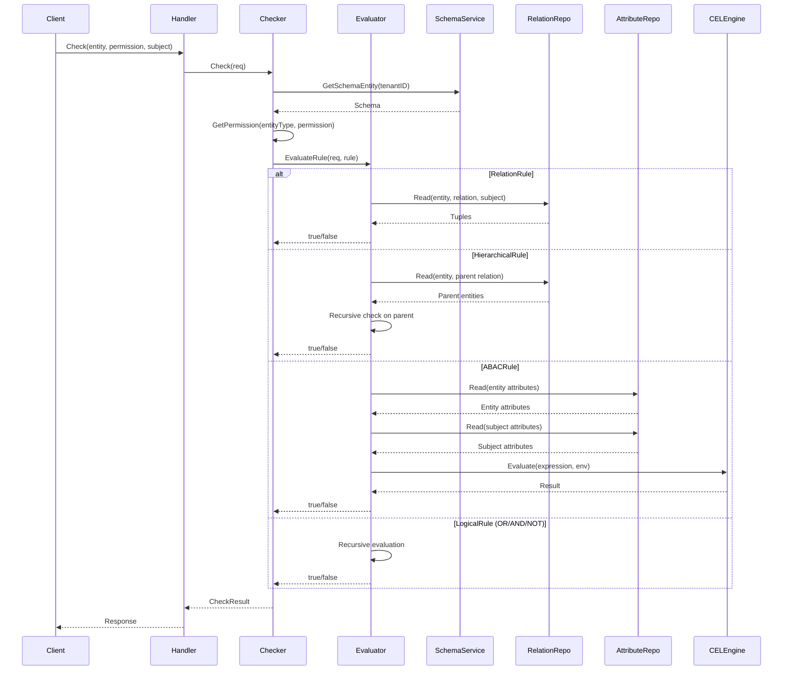

### 評価ルールの種類

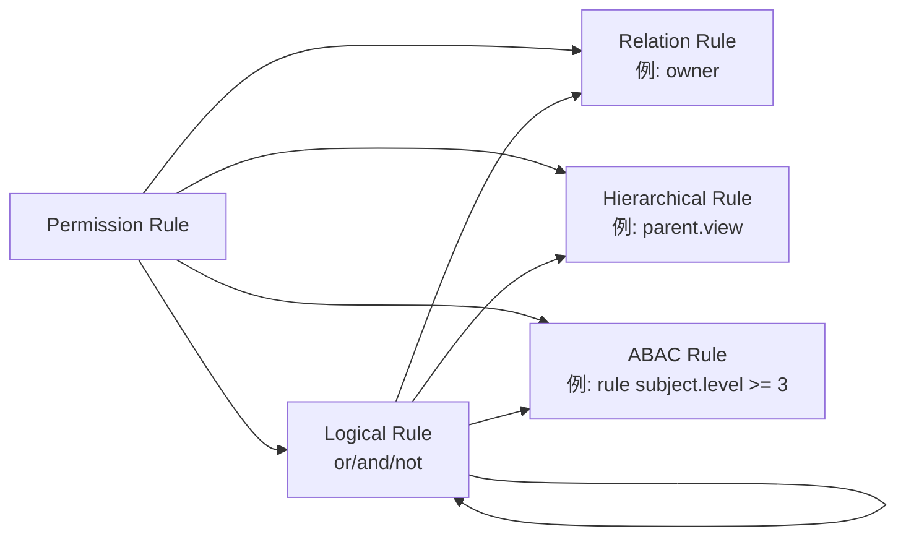

---

## DSL パーサーの処理フロー

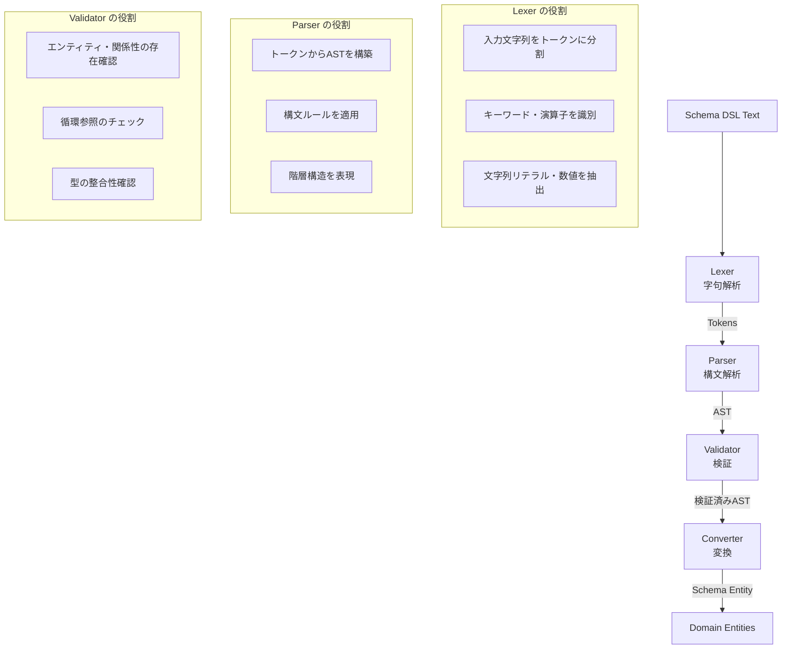

### トークン → AST → エンティティの変換例

```text
DSL:
  entity document {
    relation owner: user
    permission edit = owner or editor
  }

↓ Lexer (字句解析)

Tokens:
  ENTITY, IDENTIFIER("document"), LBRACE,
  RELATION, IDENTIFIER("owner"), COLON, IDENTIFIER("user"),
  PERMISSION, IDENTIFIER("edit"), EQUALS, IDENTIFIER("owner"), OR, IDENTIFIER("editor"),
  RBRACE

↓ Parser (構文解析)

AST:
  EntityAST {
    Name: "document"
    Relations: [
      RelationAST { Name: "owner", TargetType: "user" }
    ]
    Permissions: [
      PermissionAST {
        Name: "edit"
        Rule: LogicalPermissionAST {
          Operator: "or"
          Left: RelationPermissionAST { Relation: "owner" }
          Right: RelationPermissionAST { Relation: "editor" }
        }
      }
    ]
  }

↓ Converter (変換)

Domain Entity:
  Entity {
    Name: "document"
    Relations: [
      Relation { Name: "owner", TargetType: "user" }
    ]
    Permissions: [
      Permission {
        Name: "edit"
        Rule: LogicalRule {
          Operator: "or"
          Left: RelationRule { Relation: "owner" }
          Right: RelationRule { Relation: "editor" }
        }
      }
    ]
  }
```

---

## データフロー

### 1. スキーマ定義フロー

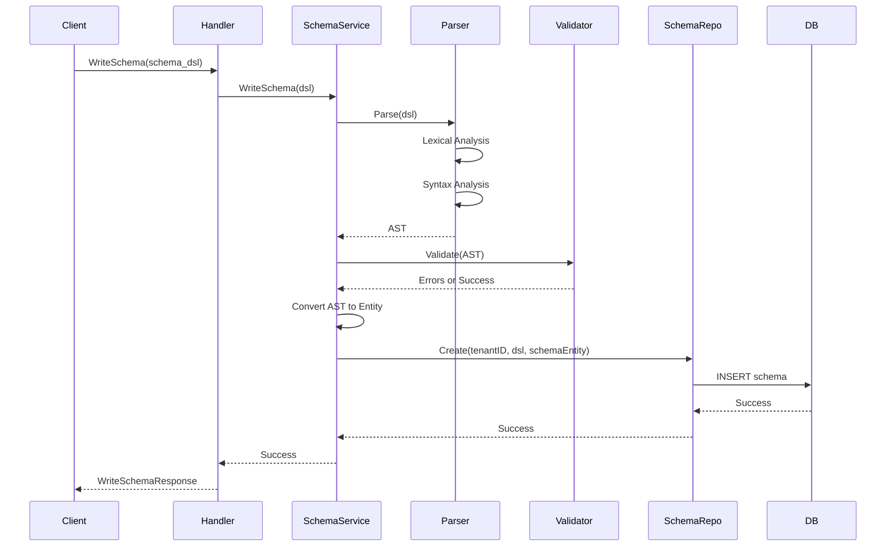

### 2. リレーション書き込みフロー

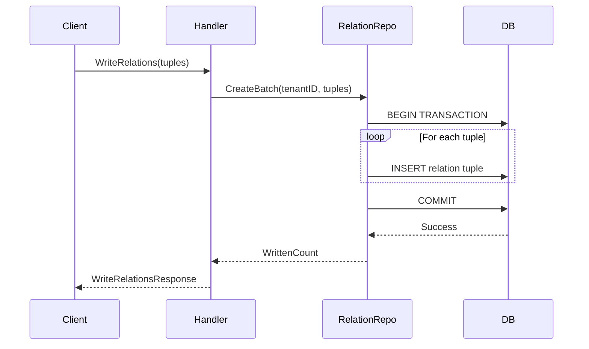

### 3. Check API の権限判定フロー

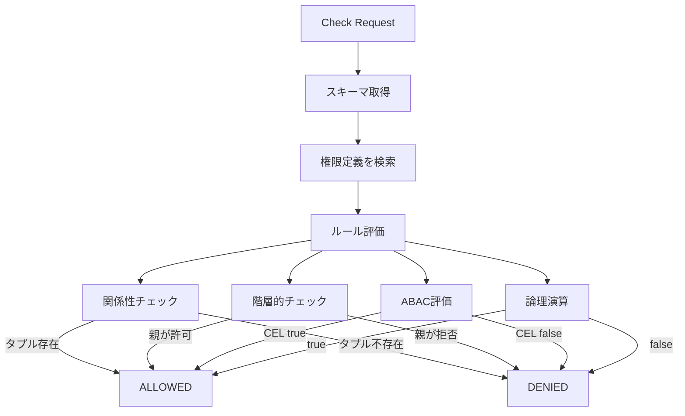

---

## コンポーネント詳細

### Authorization Engine

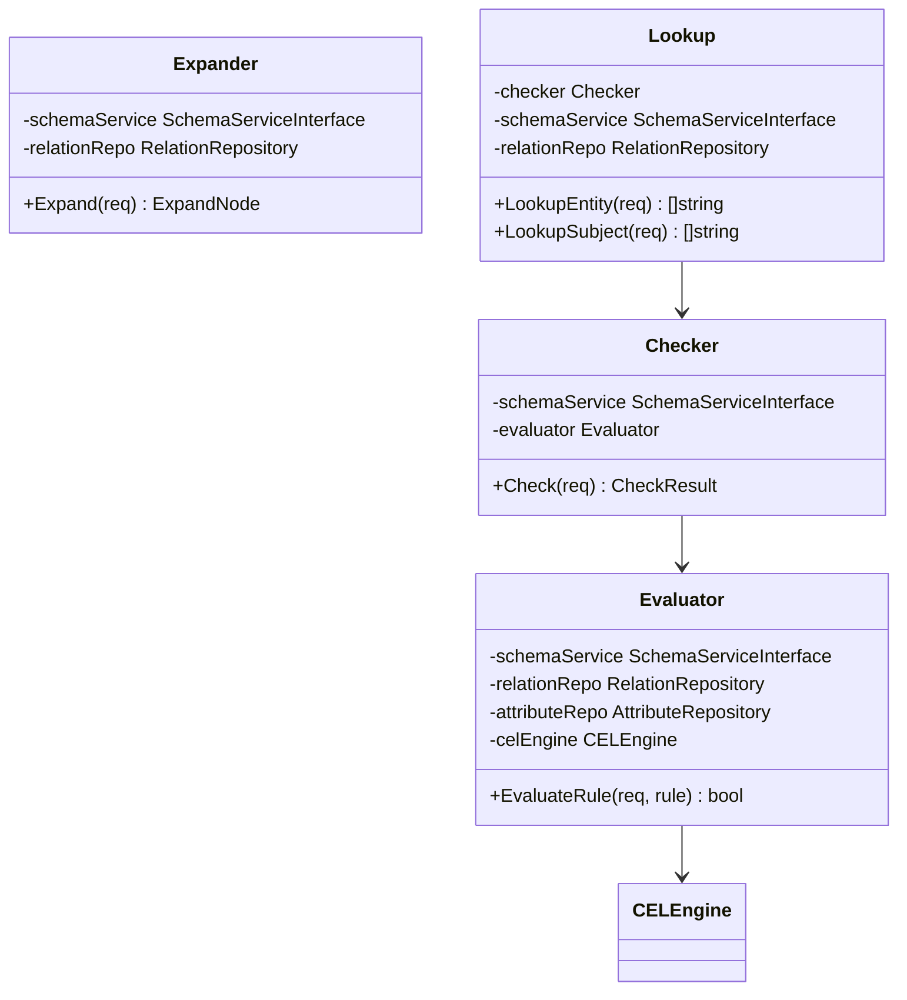

### Repository Layer

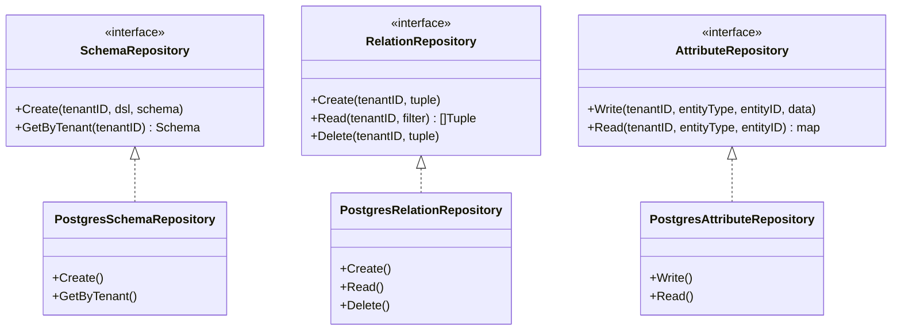

---

## 技術スタック

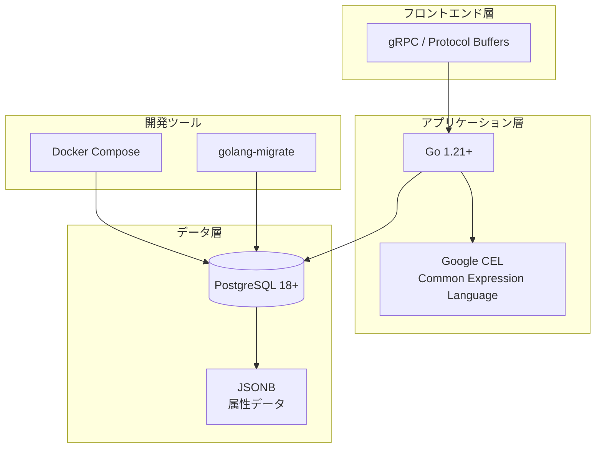

---

## 参考資料

- [DESIGN.md](DESIGN.md): 設計ドキュメント（詳細な設計決定）
- [PRD.md](PRD.md): 要求仕様書（API 仕様）
- [DEVELOPMENT.md](DEVELOPMENT.md): 開発進捗管理
- [examples/](examples/): 実装サンプルコード
