# Keruberosu アーキテクチャ図

このドキュメントでは、Keruberosu のアーキテクチャを視覚的に示します。

## 目次

1. [システム全体構成](#システム全体構成)
2. [レイヤーアーキテクチャ](#レイヤーアーキテクチャ)
3. [認可エンジンの処理フロー](#認可エンジンの処理フロー)
4. [キャッシュシステム](#キャッシュシステム)
5. [メトリクスシステム](#メトリクスシステム)
6. [DSL パーサーの処理フロー](#dslパーサーの処理フロー)
7. [データフロー](#データフロー)

---

## システム全体構成

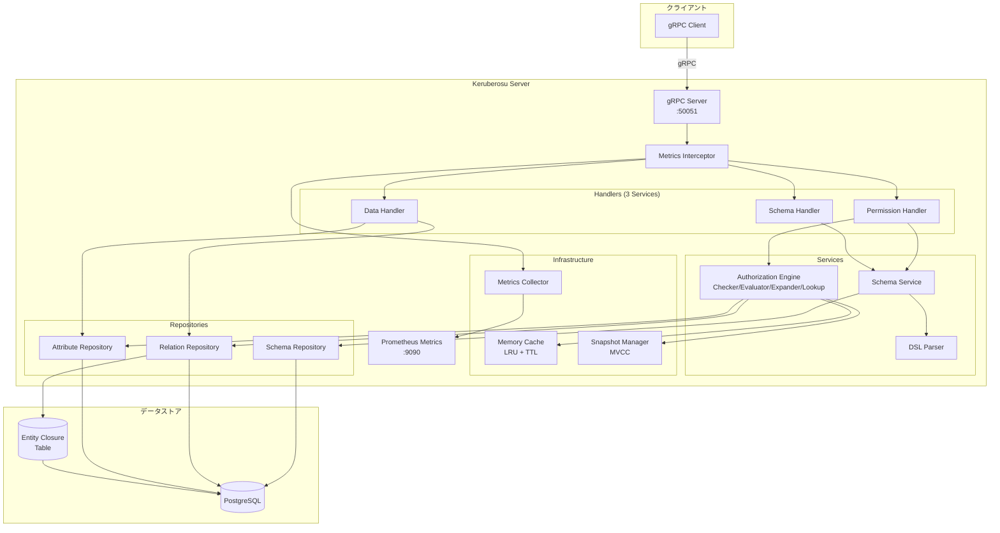

---

## レイヤーアーキテクチャ

Keruberosu は 4 層のクリーンアーキテクチャを採用しています。

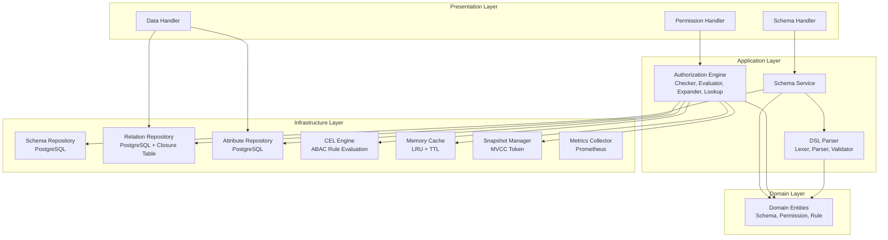

**各層の責務:**

| Layer              | 責務                           | 主要コンポーネント                 |
| ------------------ | ------------------------------ | ---------------------------------- |
| **Presentation**   | gRPC リクエスト/レスポンス処理 | `handlers/`                        |
| **Application**    | ビジネスロジック、パース処理   | `services/`                        |
| **Domain**         | ドメインモデル定義             | `entities/`                        |
| **Infrastructure** | データアクセス、キャッシュ、メトリクス | `repositories/`, `infrastructure/`, `pkg/cache/` |

---

## 認可エンジンの処理フロー

### Check API の処理フロー（キャッシュ対応）

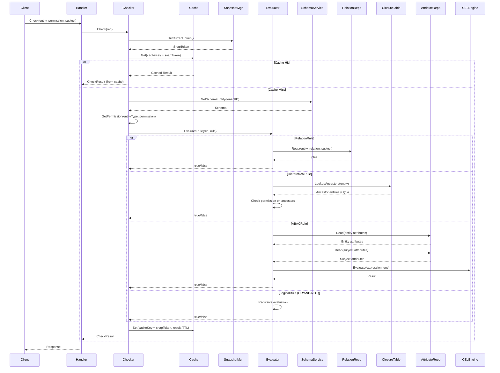

### 評価ルールの種類

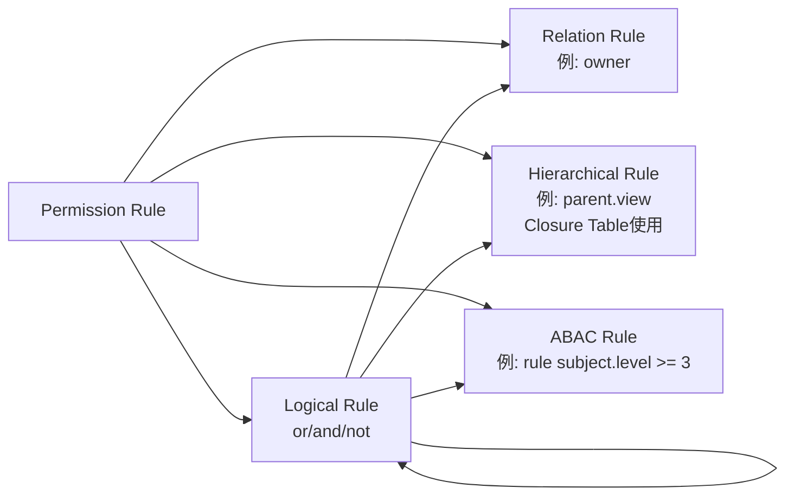

---

## キャッシュシステム

### キャッシュアーキテクチャ

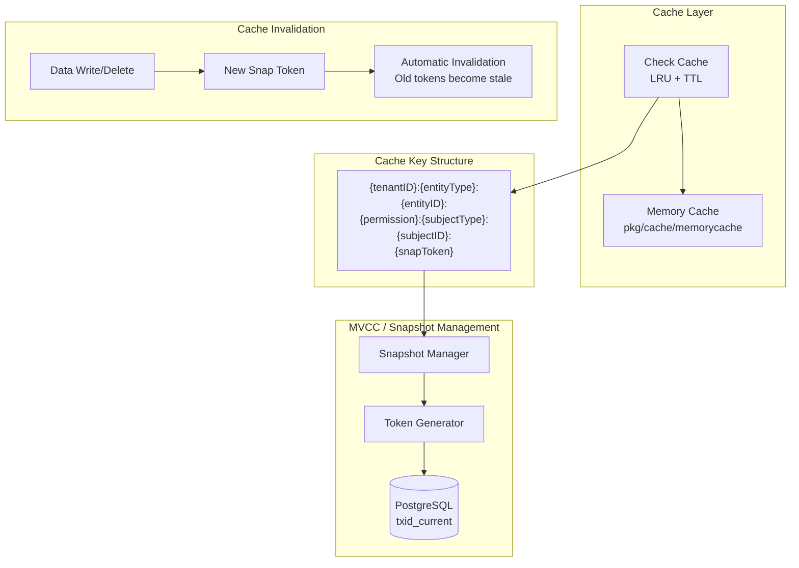

### キャッシュ設定

| 設定項目 | デフォルト値 | 説明 |
|---------|------------|------|
| `CACHE_ENABLED` | `true` | キャッシュ有効化 |
| `CACHE_MAX_MEMORY_BYTES` | `104857600` (100MB) | 最大メモリ使用量 |
| `CACHE_TTL_MINUTES` | `5` | キャッシュ TTL |
| `CACHE_METRICS` | `true` | キャッシュメトリクス有効化 |

---

## メトリクスシステム

### メトリクス収集フロー

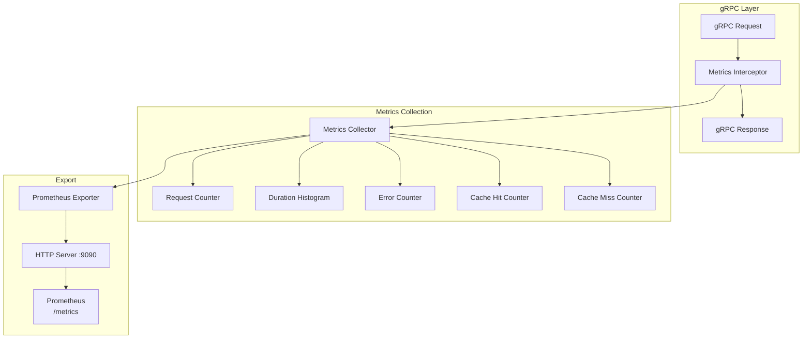

### 利用可能なメトリクス

| メトリクス名 | タイプ | 説明 |
|-------------|--------|------|
| `keruberosu_grpc_requests_total` | Counter | gRPC リクエスト総数 |
| `keruberosu_grpc_request_duration_seconds` | Histogram | リクエスト処理時間 |
| `keruberosu_grpc_errors_total` | Counter | エラー総数 |
| `keruberosu_check_cache_hits_total` | Counter | キャッシュヒット数 |
| `keruberosu_check_cache_misses_total` | Counter | キャッシュミス数 |
| `keruberosu_check_cache_hit_rate` | Gauge | キャッシュヒット率 |

---

## DSL パーサーの処理フロー

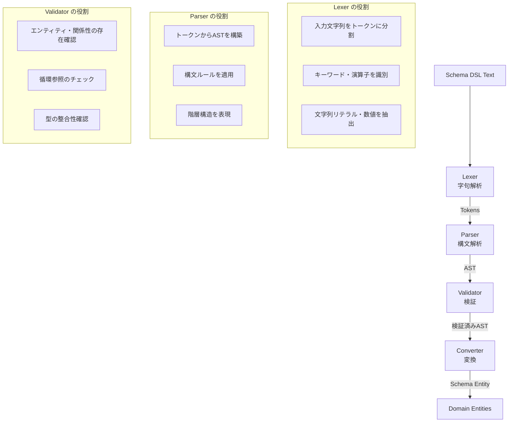

### トークン → AST → エンティティの変換例

```text
DSL:
  entity document {
    relation owner @user
    permission edit = owner or editor
  }

↓ Lexer (字句解析)

Tokens:
  ENTITY, IDENTIFIER("document"), LBRACE,
  RELATION, IDENTIFIER("owner"), AT, IDENTIFIER("user"),
  PERMISSION, IDENTIFIER("edit"), EQUALS, IDENTIFIER("owner"), OR, IDENTIFIER("editor"),
  RBRACE

↓ Parser (構文解析)

AST:
  EntityAST {
    Name: "document"
    Relations: [
      RelationAST { Name: "owner", TargetTypes: ["user"] }
    ]
    Permissions: [
      PermissionAST {
        Name: "edit"
        Rule: LogicalPermissionAST {
          Operator: "or"
          Left: RelationPermissionAST { Relation: "owner" }
          Right: RelationPermissionAST { Relation: "editor" }
        }
      }
    ]
  }

↓ Converter (変換)

Domain Entity:
  Entity {
    Name: "document"
    Relations: [
      Relation { Name: "owner", TargetTypes: ["user"] }
    ]
    Permissions: [
      Permission {
        Name: "edit"
        Rule: LogicalRule {
          Operator: "or"
          Left: RelationRule { Relation: "owner" }
          Right: RelationRule { Relation: "editor" }
        }
      }
    ]
  }
```

---

## データフロー

### 1. スキーマ定義フロー

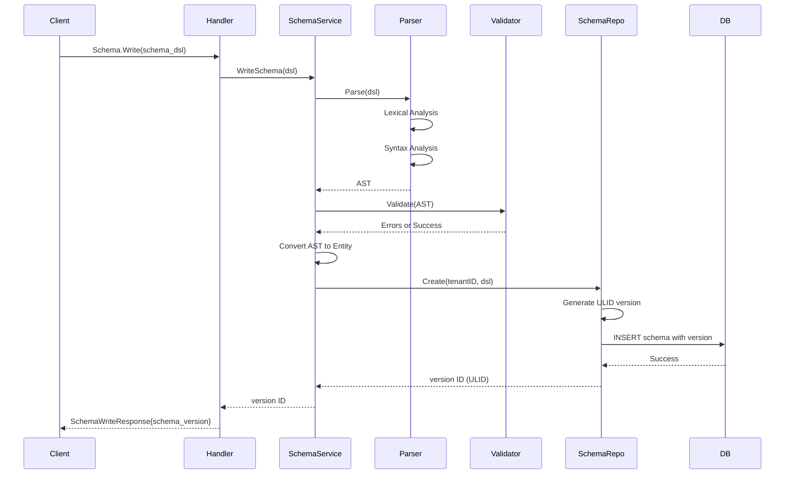

### 2. リレーション書き込みフロー（Closure Table 更新含む）

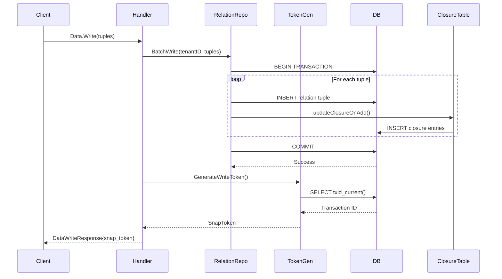

### 3. Check API の権限判定フロー

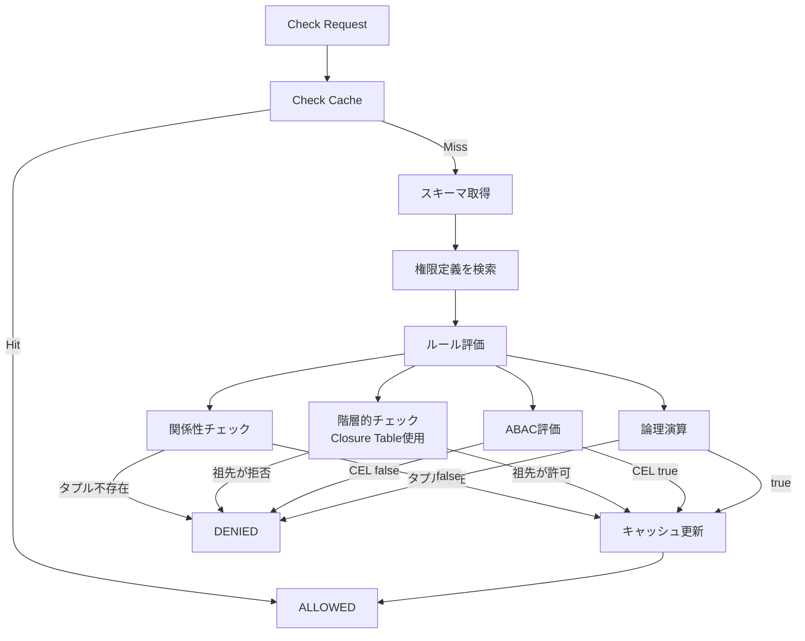

---

## コンポーネント詳細

### Authorization Engine

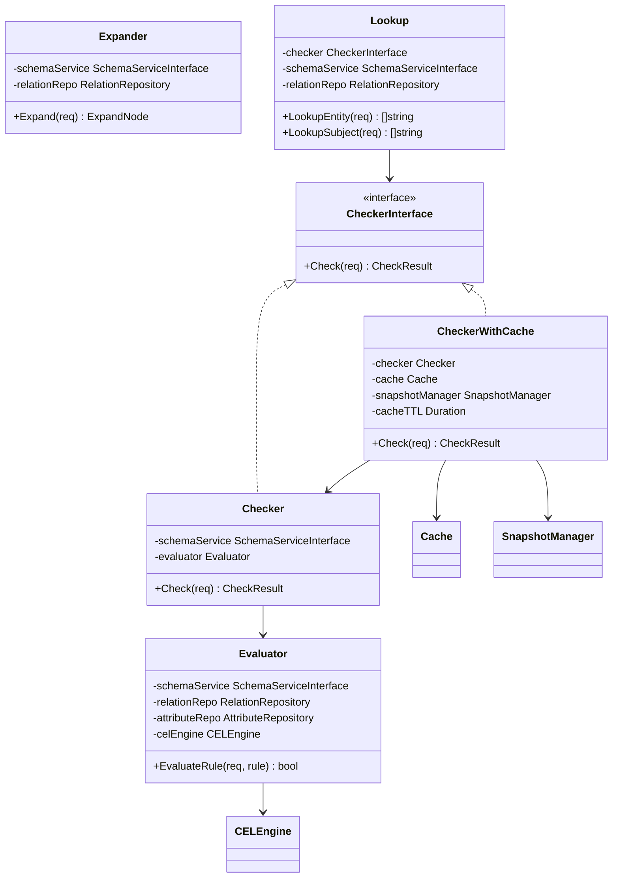

### Repository Layer

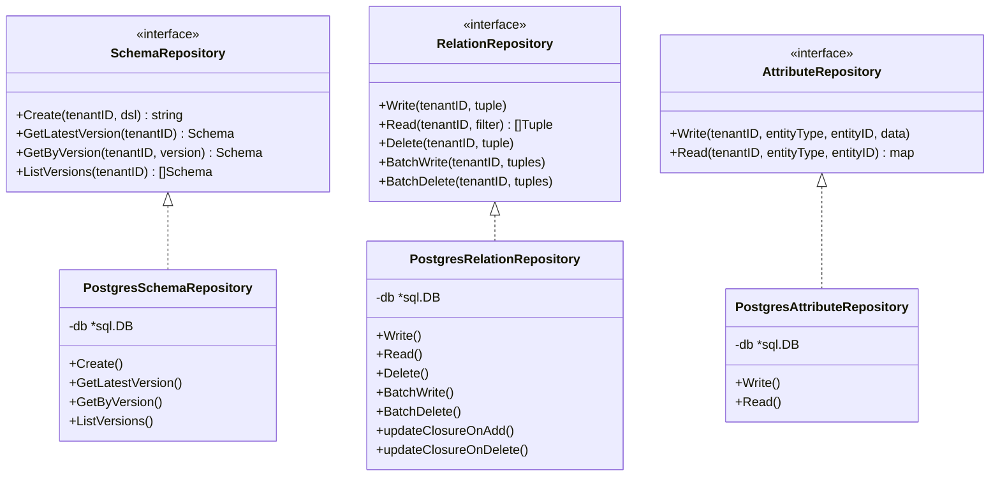

---

## 技術スタック

```mermaid
graph TB
    subgraph "フロントエンド層"
        gRPC[gRPC / Protocol Buffers]
        Prometheus[Prometheus Metrics<br/>HTTP :9090]
    end

    subgraph "アプリケーション層"
        Go[Go 1.21+]
        CEL[Google CEL<br/>Common Expression Language]
    end

    subgraph "キャッシュ層"
        MemoryCache[Memory Cache<br/>LRU + TTL]
        SnapshotToken[Snapshot Token<br/>MVCC]
    end

    subgraph "データ層"
        PostgreSQL[(PostgreSQL 18+)]
        JSONB[JSONB<br/>属性データ]
        ClosureTable[Entity Closure Table<br/>O(1) 祖先検索]
    end

    subgraph "開発ツール"
        Docker[Docker Compose]
        Migrate[golang-migrate]
    end

    gRPC --> Go
    Prometheus --> Go
    Go --> CEL
    Go --> MemoryCache
    MemoryCache --> SnapshotToken
    Go --> PostgreSQL
    PostgreSQL --> JSONB
    PostgreSQL --> ClosureTable
    Docker --> PostgreSQL
    Migrate --> PostgreSQL
```

---

## プロジェクト構造

```
keruberosu/
├── cmd/
│   ├── server/          # メインサーバー
│   └── migrate/         # マイグレーションコマンド
├── internal/
│   ├── entities/        # ドメインエンティティ
│   ├── handlers/        # gRPC ハンドラー (3サービス)
│   │   ├── permission_handler.go
│   │   ├── data_handler.go
│   │   └── schema_handler.go
│   ├── repositories/    # データアクセス層
│   │   └── postgres/    # PostgreSQL実装 + Closure Table
│   ├── services/        # ビジネスロジック
│   │   ├── authorization/  # 認可エンジン
│   │   └── parser/      # DSLパーサー
│   └── infrastructure/  # インフラ層
│       ├── cache/       # キャッシュ管理
│       ├── config/      # 設定管理
│       ├── database/    # DB接続・マイグレーション
│       └── metrics/     # Prometheusメトリクス
├── pkg/
│   └── cache/
│       └── memorycache/ # LRU+TTLキャッシュ実装
├── proto/
│   └── keruberosu/v1/   # Protocol Buffers 定義
│       ├── common.proto
│       ├── permission.proto
│       ├── data.proto
│       └── schema.proto
├── docs/                # ドキュメント
├── examples/            # サンプルコード
└── docker-compose.yml   # 開発環境
```

---

## 参考資料

- [DESIGN.md](DESIGN.md): 設計ドキュメント（詳細な設計決定）
- [PRD.md](PRD.md): 要求仕様書（API 仕様）
- [DEVELOPMENT.md](DEVELOPMENT.md): 開発進捗管理
- [PERMIFY_COMPATIBILITY_STATUS.md](PERMIFY_COMPATIBILITY_STATUS.md): Permify互換性ステータス
- [examples/](../examples/): 実装サンプルコード
