# Keruberosu アーキテクチャ図

このドキュメントでは、Keruberosu のアーキテクチャを視覚的に示します。

## 目次

1. [システム全体構成](#システム全体構成)
2. [レイヤーアーキテクチャ](#レイヤーアーキテクチャ)
3. [認可エンジンの処理フロー](#認可エンジンの処理フロー)
4. [キャッシュシステム](#キャッシュシステム)
5. [メトリクスシステム](#メトリクスシステム)
6. [DSL パーサーの処理フロー](#dsl-パーサーの処理フロー)
7. [データフロー](#データフロー)

---

## システム全体構成

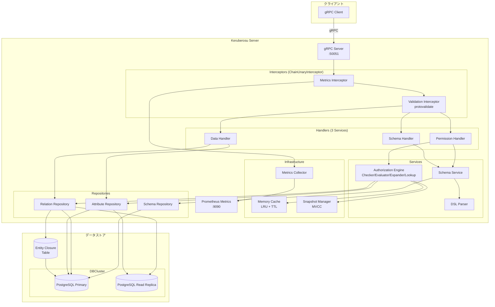
```mermaid
graph TB
    subgraph "クライアント"
        Client[gRPC Client]
    end

    subgraph "Keruberosu Server"
        GRPCServer[gRPC Server<br/>:50051]
        MetricsServer[Prometheus Metrics<br/>:9090]

        subgraph "Interceptors (ChainUnaryInterceptor)"
            MetricsInterceptor[Metrics Interceptor]
            ValidationInterceptor[Validation Interceptor<br/>protovalidate]
        end

        subgraph "Handlers (3 Services)"
            PermissionHandler[Permission Handler]
            DataHandler[Data Handler]
            SchemaHandler[Schema Handler]
        end

        subgraph "Services"
            SchemaService[Schema Service]
            AuthzEngine[Authorization Engine<br/>Checker/Evaluator/Expander/Lookup]
            Parser[DSL Parser]
        end

        subgraph "Infrastructure"
            Cache[Memory Cache<br/>LRU + TTL]
            SnapshotManager[Snapshot Manager<br/>MVCC]
            MetricsCollector[Metrics Collector]
        end

        subgraph "Repositories"
            SchemaRepo[Schema Repository]
            RelationRepo[Relation Repository]
            AttributeRepo[Attribute Repository]
        end
    end

    subgraph "データストア"
        subgraph "DBCluster"
            Primary[(PostgreSQL Primary)]
            Replica[(PostgreSQL Read Replica)]
        end
        ClosureTable[(Entity Closure<br/>Table)]
    end

    Client -->|gRPC| GRPCServer
    GRPCServer --> MetricsInterceptor
    MetricsInterceptor --> ValidationInterceptor
    ValidationInterceptor --> PermissionHandler
    ValidationInterceptor --> DataHandler
    ValidationInterceptor --> SchemaHandler

    PermissionHandler --> AuthzEngine
    PermissionHandler --> SchemaService
    DataHandler --> RelationRepo
    DataHandler --> AttributeRepo
    SchemaHandler --> SchemaService

    SchemaService --> Parser
    SchemaService --> SchemaRepo

    AuthzEngine --> Cache
    AuthzEngine --> SnapshotManager
    AuthzEngine --> RelationRepo
    AuthzEngine --> AttributeRepo

    MetricsInterceptor --> MetricsCollector
    MetricsCollector --> MetricsServer

    SchemaRepo --> Primary
    RelationRepo --> Primary
    RelationRepo --> Replica
    RelationRepo --> ClosureTable
    AttributeRepo --> Primary
    AttributeRepo --> Replica
    ClosureTable --> Primary
```

---

## レイヤーアーキテクチャ

Keruberosu は 4 層のクリーンアーキテクチャを採用しています。

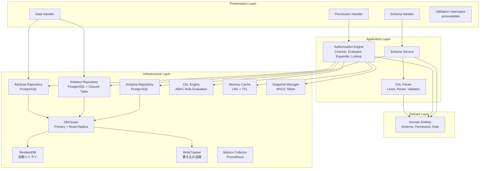
```mermaid
graph TB
    subgraph "Presentation Layer"
        PermHandler[Permission Handler]
        DataHandler[Data Handler]
        SchemaHandler[Schema Handler]
        ValidationInt[Validation Interceptor<br/>protovalidate]
    end

    subgraph "Application Layer"
        SchemaService[Schema Service]
        AuthzEngine[Authorization Engine<br/>Checker, Evaluator, Expander, Lookup]
        Parser[DSL Parser<br/>Lexer, Parser, Validator]
    end

    subgraph "Domain Layer"
        Entities[Domain Entities<br/>Schema, Permission, Rule]
    end

    subgraph "Infrastructure Layer"
        DBCluster[DBCluster<br/>Primary + Read Replica]
        ResilientDB[ResilientDB<br/>自動リトライ]
        WriteTracker[WriteTracker<br/>書き込み追跡]
        SchemaRepo[Schema Repository<br/>PostgreSQL]
        RelationRepo[Relation Repository<br/>PostgreSQL + Closure Table]
        AttributeRepo[Attribute Repository<br/>PostgreSQL]
        CELEngine[CEL Engine<br/>ABAC Rule Evaluation]
        MemoryCache[Memory Cache<br/>LRU + TTL]
        SnapshotMgr[Snapshot Manager<br/>MVCC Token]
        Metrics[Metrics Collector<br/>Prometheus]
    end

    PermHandler --> AuthzEngine
    DataHandler --> RelationRepo
    DataHandler --> AttributeRepo
    SchemaHandler --> SchemaService

    SchemaService --> Parser
    SchemaService --> SchemaRepo
    SchemaService --> Entities

    AuthzEngine --> MemoryCache
    AuthzEngine --> SnapshotMgr
    AuthzEngine --> RelationRepo
    AuthzEngine --> AttributeRepo
    AuthzEngine --> CELEngine
    AuthzEngine --> Entities

    Parser --> Entities

    DBCluster --> ResilientDB
    DBCluster --> WriteTracker
    SchemaRepo --> DBCluster
    RelationRepo --> DBCluster
    AttributeRepo --> DBCluster
```

各層の責務:

| Layer | 責務 | 主要コンポーネント |
| --- | --- | --- |
| Presentation | gRPC リクエスト/レスポンス処理、バリデーション | `handlers/`, `infrastructure/validation/` |
| Application | ビジネスロジック、パース処理 | `services/` |
| Domain | ドメインモデル定義 | `entities/` |
| Infrastructure | データアクセス、DBクラスター、キャッシュ、メトリクス | `repositories/`, `infrastructure/`, `pkg/cache/` |

---

## 認可エンジンの処理フロー

### Check API の処理フロー (キャッシュ対応)

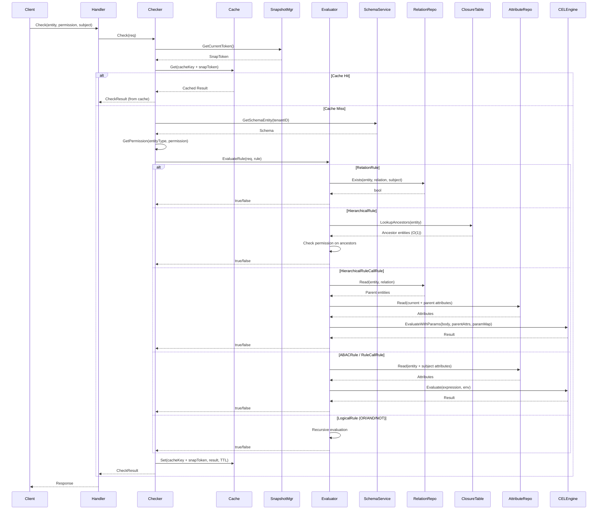
```mermaid
sequenceDiagram
    participant Client
    participant Handler
    participant Checker
    participant Cache
    participant SnapshotMgr
    participant Evaluator
    participant SchemaService
    participant RelationRepo
    participant ClosureTable
    participant AttributeRepo
    participant CELEngine

    Client->>Handler: Check(entity, permission, subject)
    Handler->>Checker: Check(req)

    Checker->>SnapshotMgr: GetCurrentToken()
    SnapshotMgr-->>Checker: SnapToken

    Checker->>Cache: Get(cacheKey + snapToken)

    alt Cache Hit
        Cache-->>Checker: Cached Result
        Checker-->>Handler: CheckResult (from cache)
    else Cache Miss
        Checker->>SchemaService: GetSchemaEntity(tenantID)
        SchemaService-->>Checker: Schema
        Checker->>Checker: GetPermission(entityType, permission)
        Checker->>Evaluator: EvaluateRule(req, rule)

        alt RelationRule
            Evaluator->>RelationRepo: Exists(entity, relation, subject)
            RelationRepo-->>Evaluator: bool
            Evaluator-->>Checker: true/false
        else HierarchicalRule
            Evaluator->>ClosureTable: LookupAncestors(entity)
            ClosureTable-->>Evaluator: Ancestor entities (O(1))
            Evaluator->>Evaluator: Check permission on ancestors
            Evaluator-->>Checker: true/false
        else HierarchicalRuleCallRule
            Evaluator->>RelationRepo: Read(entity, relation)
            RelationRepo-->>Evaluator: Parent entities
            Evaluator->>AttributeRepo: Read(current + parent attributes)
            AttributeRepo-->>Evaluator: Attributes
            Evaluator->>CELEngine: EvaluateWithParams(body, parentAttrs, paramMap)
            CELEngine-->>Evaluator: Result
            Evaluator-->>Checker: true/false
        else ABACRule / RuleCallRule
            Evaluator->>AttributeRepo: Read(entity + subject attributes)
            AttributeRepo-->>Evaluator: Attributes
            Evaluator->>CELEngine: Evaluate(expression, env)
            CELEngine-->>Evaluator: Result
            Evaluator-->>Checker: true/false
        else LogicalRule (OR/AND/NOT)
            Evaluator->>Evaluator: Recursive evaluation
            Evaluator-->>Checker: true/false
        end

        Checker->>Cache: Set(cacheKey + snapToken, result, TTL)
        Checker-->>Handler: CheckResult
    end

    Handler-->>Client: Response
```

### 評価ルールの種類

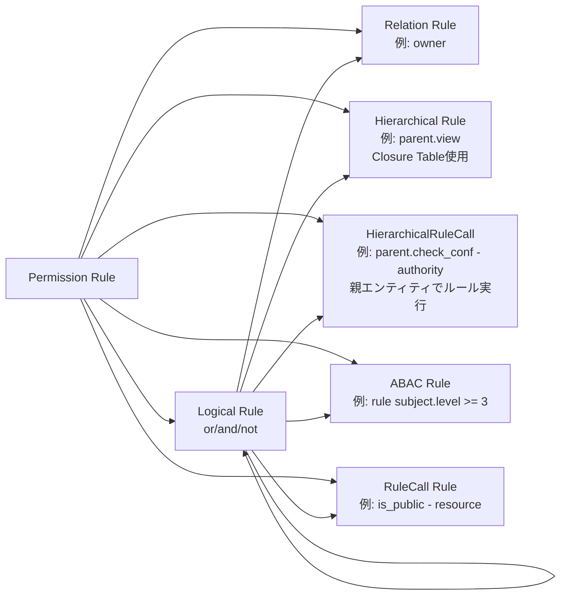
```mermaid
graph LR
    Rule[Permission Rule]

    Rule --> RelationRule[Relation Rule<br/>例: owner]
    Rule --> HierarchicalRule[Hierarchical Rule<br/>例: parent.view<br/>Closure Table使用]
    Rule --> HierarchicalRuleCallRule[HierarchicalRuleCall<br/>例: parent.check_conf - authority<br/>親エンティティでルール実行]
    Rule --> ABACRule[ABAC Rule<br/>例: rule subject.level >= 3]
    Rule --> RuleCallRule[RuleCall Rule<br/>例: is_public - resource]
    Rule --> LogicalRule[Logical Rule<br/>or/and/not]

    LogicalRule --> RelationRule
    LogicalRule --> HierarchicalRule
    LogicalRule --> HierarchicalRuleCallRule
    LogicalRule --> ABACRule
    LogicalRule --> RuleCallRule
    LogicalRule --> LogicalRule
```

---

## キャッシュシステム

### キャッシュアーキテクチャ

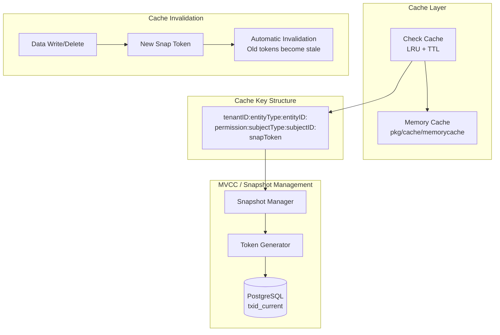
```mermaid
graph TB
    subgraph "Cache Layer"
        CheckCache[Check Cache<br/>LRU + TTL]
        MemoryCache[Memory Cache<br/>pkg/cache/memorycache]
    end

    subgraph "Cache Key Structure"
        Key[tenantID:entityType:entityID:<br/>permission:subjectType:subjectID:<br/>snapToken]
    end

    subgraph "MVCC / Snapshot Management"
        SnapshotMgr[Snapshot Manager]
        TokenGen[Token Generator]
        DB[(PostgreSQL<br/>txid_current)]
    end

    CheckCache --> MemoryCache
    CheckCache --> Key
    Key --> SnapshotMgr
    SnapshotMgr --> TokenGen
    TokenGen --> DB

    subgraph "Cache Invalidation"
        WriteOp[Data Write/Delete]
        NewToken[New Snap Token]
        AutoInvalidate[Automatic Invalidation<br/>Old tokens become stale]
    end

    WriteOp --> NewToken
    NewToken --> AutoInvalidate
```

### キャッシュ設定

| 設定項目 | デフォルト値 | 説明 |
| --- | --- | --- |
| `CACHE_ENABLED` | `true` | キャッシュ有効化 |
| `CACHE_MAX_MEMORY_BYTES` | `104857600` (100MB) | 最大メモリ使用量 |
| `CACHE_TTL_MINUTES` | `5` | キャッシュ TTL |
| `CACHE_METRICS` | `true` | キャッシュメトリクス有効化 |

---

## メトリクスシステム

### メトリクス収集フロー

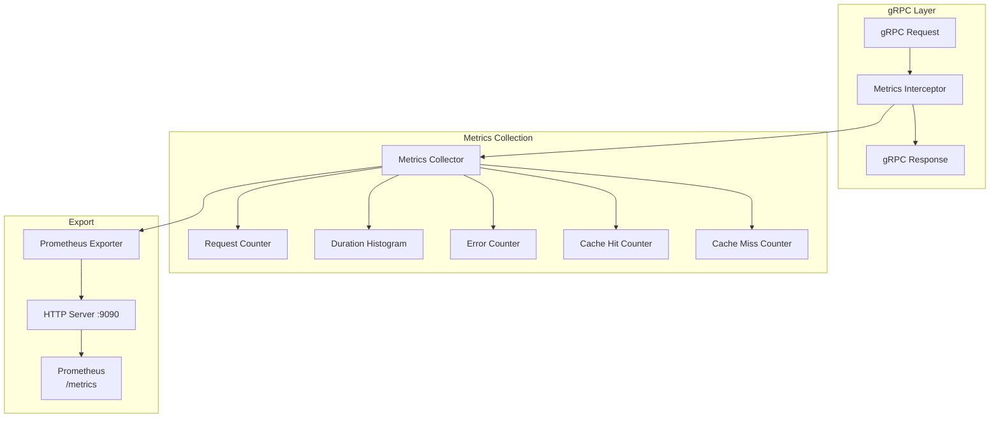
```mermaid
graph TB
    subgraph "gRPC Layer"
        Request[gRPC Request]
        Interceptor[Metrics Interceptor]
        Response[gRPC Response]
    end

    subgraph "Metrics Collection"
        Collector[Metrics Collector]
        RequestCount[Request Counter]
        Duration[Duration Histogram]
        ErrorCount[Error Counter]
        CacheHits[Cache Hit Counter]
        CacheMisses[Cache Miss Counter]
    end

    subgraph "Export"
        Exporter[Prometheus Exporter]
        HTTPServer[HTTP Server :9090]
        Prometheus[Prometheus<br/>/metrics]
    end

    Request --> Interceptor
    Interceptor --> Collector
    Interceptor --> Response

    Collector --> RequestCount
    Collector --> Duration
    Collector --> ErrorCount
    Collector --> CacheHits
    Collector --> CacheMisses

    Collector --> Exporter
    Exporter --> HTTPServer
    HTTPServer --> Prometheus
```

### 利用可能なメトリクス

| メトリクス名 | タイプ | 説明 |
| --- | --- | --- |
| `keruberosu_grpc_requests_total` | Counter | gRPC リクエスト総数 |
| `keruberosu_grpc_request_duration_seconds` | Histogram | リクエスト処理時間 |
| `keruberosu_grpc_errors_total` | Counter | エラー総数 |
| `keruberosu_check_cache_hits_total` | Counter | キャッシュヒット数 |
| `keruberosu_check_cache_misses_total` | Counter | キャッシュミス数 |
| `keruberosu_check_cache_hit_rate` | Gauge | キャッシュヒット率 |

---

## DSL パーサーの処理フロー

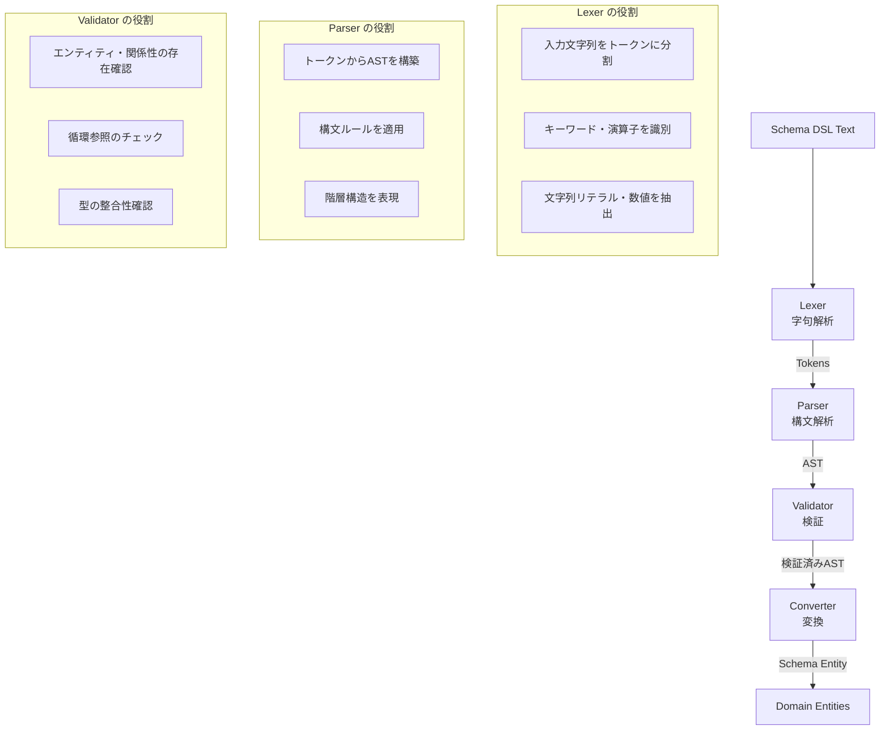
```mermaid
graph TB
    Input[Schema DSL Text]
    Lexer[Lexer<br/>字句解析]
    Parser[Parser<br/>構文解析]
    Validator[Validator<br/>検証]
    Converter[Converter<br/>変換]
    Output[Domain Entities]

    Input --> Lexer
    Lexer -->|Tokens| Parser
    Parser -->|AST| Validator
    Validator -->|検証済みAST| Converter
    Converter -->|Schema Entity| Output

    subgraph "Lexer の役割"
        L1[入力文字列をトークンに分割]
        L2[キーワード・演算子を識別]
        L3[文字列リテラル・数値を抽出]
    end

    subgraph "Parser の役割"
        P1[トークンからASTを構築]
        P2[構文ルールを適用]
        P3[階層構造を表現]
    end

    subgraph "Validator の役割"
        V1[エンティティ・関係性の存在確認]
        V2[循環参照のチェック]
        V3[型の整合性確認]
    end
```

### トークン → AST → エンティティの変換例

```text
DSL:
  entity document {
    relation owner @user
    permission edit = owner or editor
  }

↓ Lexer (字句解析)

Tokens:
  ENTITY, IDENTIFIER("document"), LBRACE,
  RELATION, IDENTIFIER("owner"), AT, IDENTIFIER("user"),
  PERMISSION, IDENTIFIER("edit"), EQUALS, IDENTIFIER("owner"), OR, IDENTIFIER("editor"),
  RBRACE

↓ Parser (構文解析)

AST:
  EntityAST {
    Name: "document"
    Relations: [
      RelationAST { Name: "owner", TargetTypes: ["user"] }
    ]
    Permissions: [
      PermissionAST {
        Name: "edit"
        Rule: LogicalPermissionAST {
          Operator: "or"
          Left: RelationPermissionAST { Relation: "owner" }
          Right: RelationPermissionAST { Relation: "editor" }
        }
      }
    ]
  }

↓ Converter (変換)

Domain Entity:
  Entity {
    Name: "document"
    Relations: [
      Relation { Name: "owner", TargetTypes: ["user"] }
    ]
    Permissions: [
      Permission {
        Name: "edit"
        Rule: LogicalRule {
          Operator: "or"
          Left: RelationRule { Relation: "owner" }
          Right: RelationRule { Relation: "editor" }
        }
      }
    ]
  }
```

---

## データフロー

### 1. スキーマ定義フロー

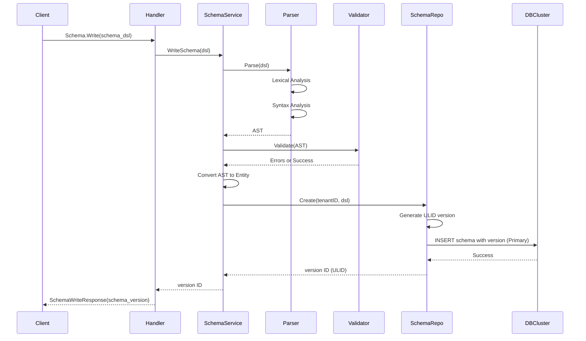
```mermaid
sequenceDiagram
    participant Client
    participant Handler
    participant SchemaService
    participant Parser
    participant Validator
    participant SchemaRepo
    participant DBCluster

    Client->>Handler: Schema.Write(schema_dsl)
    Handler->>SchemaService: WriteSchema(dsl)
    SchemaService->>Parser: Parse(dsl)
    Parser->>Parser: Lexical Analysis
    Parser->>Parser: Syntax Analysis
    Parser-->>SchemaService: AST
    SchemaService->>Validator: Validate(AST)
    Validator-->>SchemaService: Errors or Success
    SchemaService->>SchemaService: Convert AST to Entity
    SchemaService->>SchemaRepo: Create(tenantID, dsl)
    SchemaRepo->>SchemaRepo: Generate ULID version
    SchemaRepo->>DBCluster: INSERT schema with version (Primary)
    DBCluster-->>SchemaRepo: Success
    SchemaRepo-->>SchemaService: version ID (ULID)
    SchemaService-->>Handler: version ID
    Handler-->>Client: SchemaWriteResponse(schema_version)
```

### 2. リレーション書き込みフロー (Closure Table 更新含む)

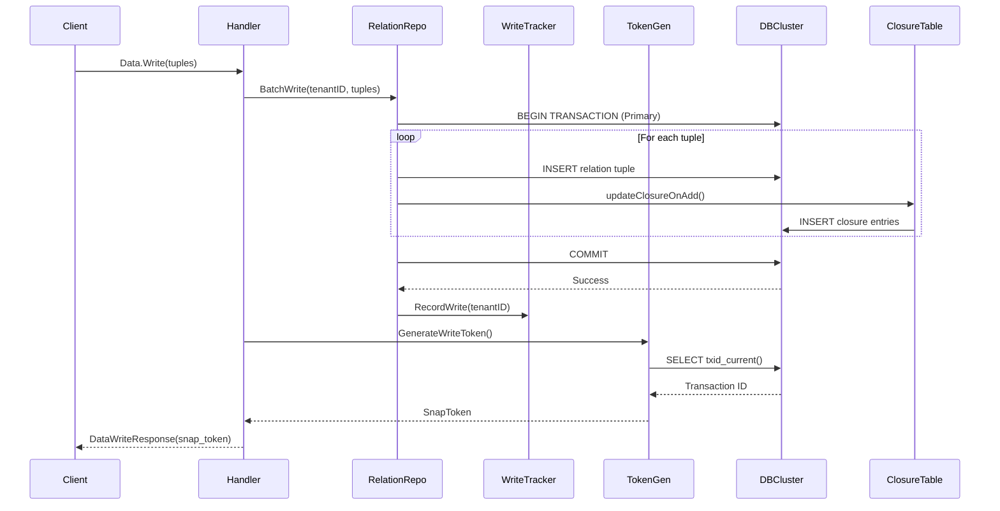
```mermaid
sequenceDiagram
    participant Client
    participant Handler
    participant RelationRepo
    participant WriteTracker
    participant TokenGen
    participant DBCluster
    participant ClosureTable

    Client->>Handler: Data.Write(tuples)
    Handler->>RelationRepo: BatchWrite(tenantID, tuples)
    RelationRepo->>DBCluster: BEGIN TRANSACTION (Primary)
    loop For each tuple
        RelationRepo->>DBCluster: INSERT relation tuple
        RelationRepo->>ClosureTable: updateClosureOnAdd()
        ClosureTable->>DBCluster: INSERT closure entries
    end
    RelationRepo->>DBCluster: COMMIT
    DBCluster-->>RelationRepo: Success
    RelationRepo->>WriteTracker: RecordWrite(tenantID)
    Handler->>TokenGen: GenerateWriteToken()
    TokenGen->>DBCluster: SELECT txid_current()
    DBCluster-->>TokenGen: Transaction ID
    TokenGen-->>Handler: SnapToken
    Handler-->>Client: DataWriteResponse(snap_token)
```

### 3. Check API の権限判定フロー

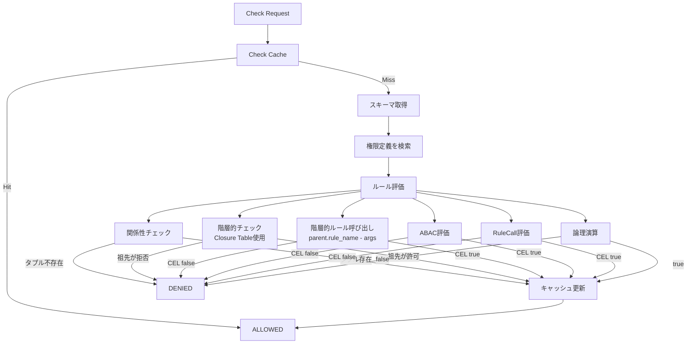
```mermaid
graph TB
    Start[Check Request]
    CheckCache[Check Cache]
    GetSchema[スキーマ取得]
    FindPermission[権限定義を検索]
    EvaluateRule[ルール評価]

    CheckRelation[関係性チェック]
    CheckHierarchical[階層的チェック<br/>Closure Table使用]
    CheckHierarchicalRuleCall[階層的ルール呼び出し<br/>parent.rule_name - args]
    CheckABAC[ABAC評価]
    CheckRuleCall[RuleCall評価]
    CheckLogical[論理演算]

    UpdateCache[キャッシュ更新]
    Success[ALLOWED]
    Denied[DENIED]

    Start --> CheckCache
    CheckCache -->|Hit| Success
    CheckCache -->|Miss| GetSchema
    GetSchema --> FindPermission
    FindPermission --> EvaluateRule

    EvaluateRule --> CheckRelation
    EvaluateRule --> CheckHierarchical
    EvaluateRule --> CheckHierarchicalRuleCall
    EvaluateRule --> CheckABAC
    EvaluateRule --> CheckRuleCall
    EvaluateRule --> CheckLogical

    CheckRelation -->|タプル存在| UpdateCache
    CheckRelation -->|タプル不存在| Denied

    CheckHierarchical -->|祖先が許可| UpdateCache
    CheckHierarchical -->|祖先が拒否| Denied

    CheckHierarchicalRuleCall -->|CEL true| UpdateCache
    CheckHierarchicalRuleCall -->|CEL false| Denied

    CheckABAC -->|CEL true| UpdateCache
    CheckABAC -->|CEL false| Denied

    CheckRuleCall -->|CEL true| UpdateCache
    CheckRuleCall -->|CEL false| Denied

    CheckLogical -->|true| UpdateCache
    CheckLogical -->|false| Denied

    UpdateCache --> Success
```

### 4. Lookup API の 3 パスロジック

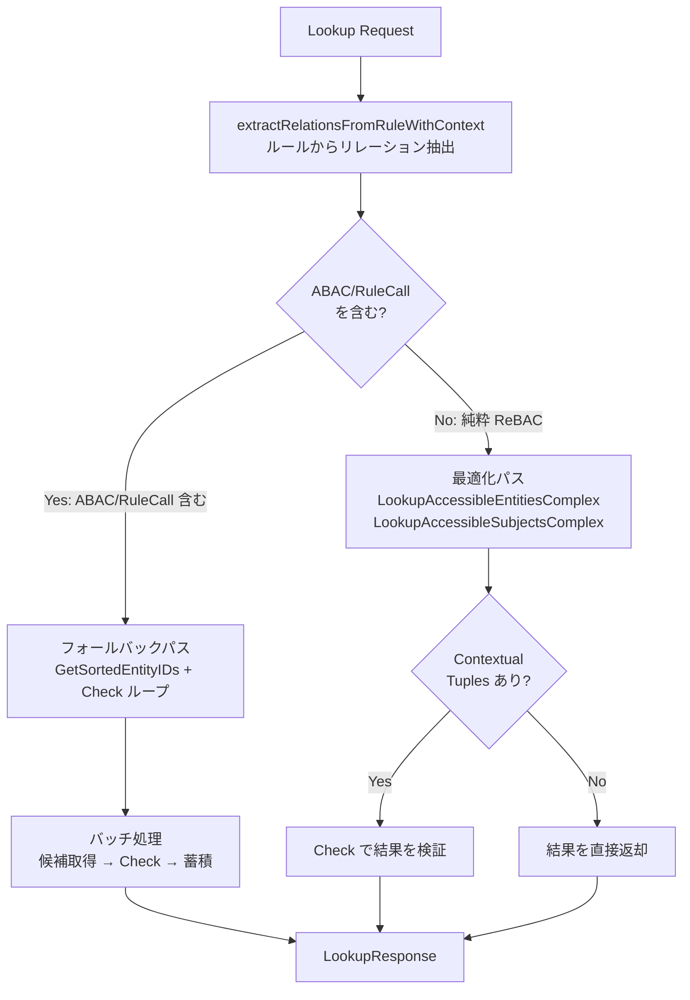
```mermaid
graph TB
    Start[Lookup Request]
    ExtractRules[extractRelationsFromRuleWithContext<br/>ルールからリレーション抽出]
    CheckResolvable{ABAC/RuleCall<br/>を含む?}

    OptimizedPath[最適化パス<br/>LookupAccessibleEntitiesComplex<br/>LookupAccessibleSubjectsComplex]
    CheckContextual{Contextual<br/>Tuples あり?}
    VerifyWithCheck[Check で結果を検証]
    DirectReturn[結果を直接返却]

    FallbackPath[フォールバックパス<br/>GetSortedEntityIDs + Check ループ]
    BatchLoop[バッチ処理<br/>候補取得 → Check → 蓄積]

    Result[LookupResponse]

    Start --> ExtractRules
    ExtractRules --> CheckResolvable

    CheckResolvable -->|No: 純粋 ReBAC| OptimizedPath
    CheckResolvable -->|Yes: ABAC/RuleCall 含む| FallbackPath

    OptimizedPath --> CheckContextual
    CheckContextual -->|Yes| VerifyWithCheck
    CheckContextual -->|No| DirectReturn

    FallbackPath --> BatchLoop
    BatchLoop --> Result

    VerifyWithCheck --> Result
    DirectReturn --> Result
```

---

## コンポーネント詳細

### Authorization Engine

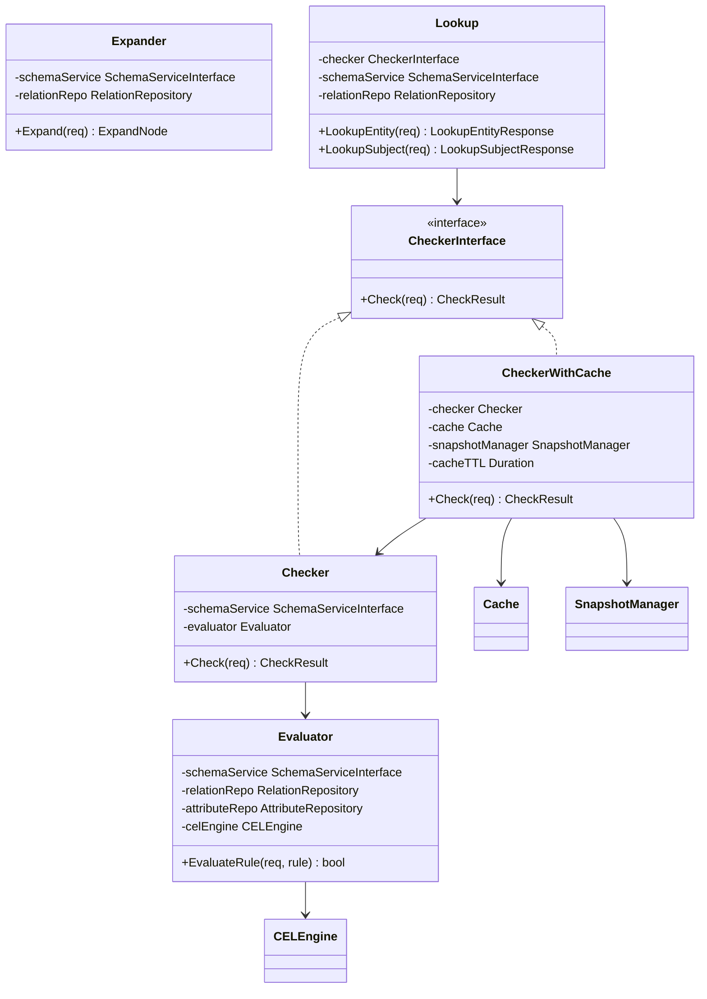
```mermaid
classDiagram
    class CheckerInterface {
        <<interface>>
        +Check(req) CheckResult
    }

    class Checker {
        +Check(req) CheckResult
        -schemaService SchemaServiceInterface
        -evaluator Evaluator
    }

    class CheckerWithCache {
        +Check(req) CheckResult
        -checker Checker
        -cache Cache
        -snapshotManager SnapshotManager
        -cacheTTL Duration
    }

    class Evaluator {
        +EvaluateRule(req, rule) bool
        -schemaService SchemaServiceInterface
        -relationRepo RelationRepository
        -attributeRepo AttributeRepository
        -celEngine CELEngine
    }

    class Expander {
        +Expand(req) ExpandNode
        -schemaService SchemaServiceInterface
        -relationRepo RelationRepository
    }

    class Lookup {
        +LookupEntity(req) LookupEntityResponse
        +LookupSubject(req) LookupSubjectResponse
        -checker CheckerInterface
        -schemaService SchemaServiceInterface
        -relationRepo RelationRepository
    }

    CheckerInterface <|.. Checker
    CheckerInterface <|.. CheckerWithCache
    CheckerWithCache --> Checker
    CheckerWithCache --> Cache
    CheckerWithCache --> SnapshotManager
    Checker --> Evaluator
    Lookup --> CheckerInterface
    Evaluator --> CELEngine
```

### Database Layer

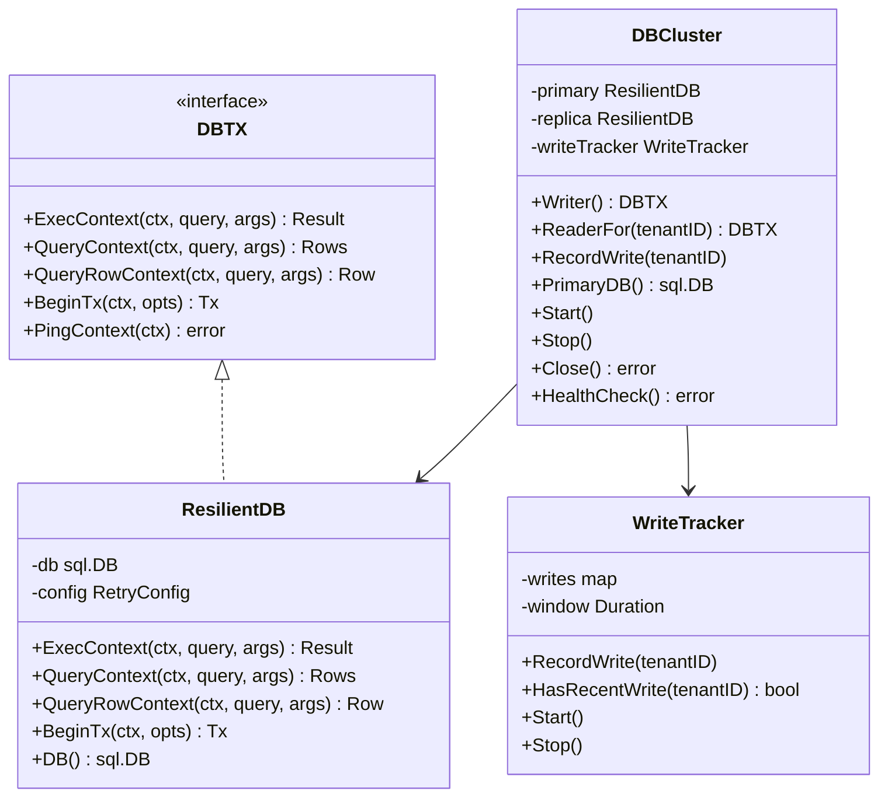
```mermaid
classDiagram
    class DBTX {
        <<interface>>
        +ExecContext(ctx, query, args) Result
        +QueryContext(ctx, query, args) Rows
        +QueryRowContext(ctx, query, args) Row
        +BeginTx(ctx, opts) Tx
        +PingContext(ctx) error
    }

    class DBCluster {
        +Writer() DBTX
        +ReaderFor(tenantID) DBTX
        +RecordWrite(tenantID)
        +PrimaryDB() sql.DB
        +Start()
        +Stop()
        +Close() error
        +HealthCheck() error
        -primary ResilientDB
        -replica ResilientDB
        -writeTracker WriteTracker
    }

    class ResilientDB {
        +ExecContext(ctx, query, args) Result
        +QueryContext(ctx, query, args) Rows
        +QueryRowContext(ctx, query, args) Row
        +BeginTx(ctx, opts) Tx
        +DB() sql.DB
        -db sql.DB
        -config RetryConfig
    }

    class WriteTracker {
        +RecordWrite(tenantID)
        +HasRecentWrite(tenantID) bool
        +Start()
        +Stop()
        -writes map
        -window Duration
    }

    DBTX <|.. ResilientDB
    DBCluster --> ResilientDB
    DBCluster --> WriteTracker
```

### Repository Layer

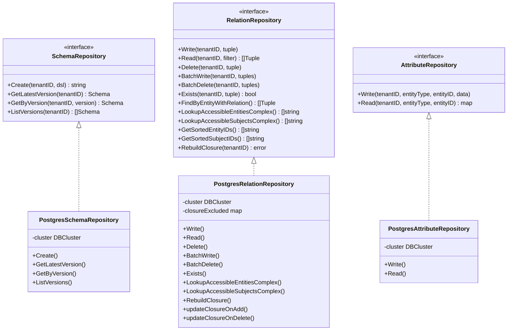
```mermaid
classDiagram
    class SchemaRepository {
        <<interface>>
        +Create(tenantID, dsl) string
        +GetLatestVersion(tenantID) Schema
        +GetByVersion(tenantID, version) Schema
        +ListVersions(tenantID) []Schema
    }

    class RelationRepository {
        <<interface>>
        +Write(tenantID, tuple)
        +Read(tenantID, filter) []Tuple
        +Delete(tenantID, tuple)
        +BatchWrite(tenantID, tuples)
        +BatchDelete(tenantID, tuples)
        +Exists(tenantID, tuple) bool
        +FindByEntityWithRelation() []Tuple
        +LookupAccessibleEntitiesComplex() []string
        +LookupAccessibleSubjectsComplex() []string
        +GetSortedEntityIDs() []string
        +GetSortedSubjectIDs() []string
        +RebuildClosure(tenantID) error
    }

    class AttributeRepository {
        <<interface>>
        +Write(tenantID, entityType, entityID, data)
        +Read(tenantID, entityType, entityID) map
    }

    class PostgresSchemaRepository {
        +Create()
        +GetLatestVersion()
        +GetByVersion()
        +ListVersions()
        -cluster DBCluster
    }

    class PostgresRelationRepository {
        +Write()
        +Read()
        +Delete()
        +BatchWrite()
        +BatchDelete()
        +Exists()
        +LookupAccessibleEntitiesComplex()
        +LookupAccessibleSubjectsComplex()
        +RebuildClosure()
        +updateClosureOnAdd()
        +updateClosureOnDelete()
        -cluster DBCluster
        -closureExcluded map
    }

    class PostgresAttributeRepository {
        +Write()
        +Read()
        -cluster DBCluster
    }

    SchemaRepository <|.. PostgresSchemaRepository
    RelationRepository <|.. PostgresRelationRepository
    AttributeRepository <|.. PostgresAttributeRepository
```

---

## 技術スタック

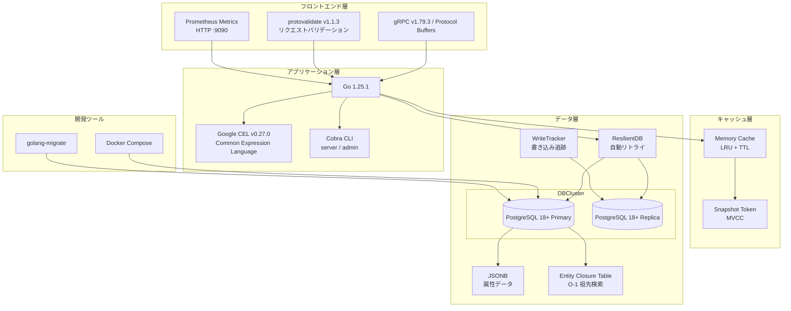
```mermaid
graph TB
    subgraph "フロントエンド層"
        gRPC[gRPC v1.79.3 / Protocol Buffers]
        ProtoValidate[protovalidate v1.1.3<br/>リクエストバリデーション]
        Prometheus[Prometheus Metrics<br/>HTTP :9090]
    end

    subgraph "アプリケーション層"
        Go[Go 1.25.1]
        CEL[Google CEL v0.27.0<br/>Common Expression Language]
        Cobra[Cobra CLI<br/>server / admin]
    end

    subgraph "キャッシュ層"
        MemoryCache[Memory Cache<br/>LRU + TTL]
        SnapshotToken[Snapshot Token<br/>MVCC]
    end

    subgraph "データ層"
        subgraph "DBCluster"
            PostgreSQL[(PostgreSQL 18+ Primary)]
            ReadReplica[(PostgreSQL 18+ Replica)]
        end
        ResilientDB[ResilientDB<br/>自動リトライ]
        WriteTracker[WriteTracker<br/>書き込み追跡]
        JSONB[JSONB<br/>属性データ]
        ClosureTable[Entity Closure Table<br/>O-1 祖先検索]
    end

    subgraph "開発ツール"
        Docker[Docker Compose]
        Migrate[golang-migrate]
    end

    gRPC --> Go
    ProtoValidate --> Go
    Prometheus --> Go
    Go --> CEL
    Go --> Cobra
    Go --> MemoryCache
    MemoryCache --> SnapshotToken
    Go --> ResilientDB
    ResilientDB --> PostgreSQL
    ResilientDB --> ReadReplica
    PostgreSQL --> JSONB
    PostgreSQL --> ClosureTable
    WriteTracker --> ReadReplica
    Docker --> PostgreSQL
    Migrate --> PostgreSQL
```

### 主要依存ライブラリ

| ライブラリ | バージョン | 用途 |
| --- | --- | --- |
| Go | 1.25.1 | ランタイム |
| google.golang.org/grpc | v1.79.3 | gRPC サーバー/クライアント |
| github.com/google/cel-go | v0.27.0 | CEL 式評価 (ABAC) |
| buf.build/go/protovalidate | v1.1.3 | gRPC リクエストバリデーション |
| github.com/lib/pq | v1.10.9 | PostgreSQL ドライバー |
| github.com/spf13/cobra | v1.10.1 | CLI フレームワーク |
| github.com/spf13/viper | v1.21.0 | 設定管理 |
| github.com/golang-migrate/migrate/v4 | v4.19.0 | DBマイグレーション |
| github.com/prometheus/client_golang | v1.18.0 | Prometheus メトリクス |

---

## プロジェクト構造

```text
keruberosu/
├── cmd/
│   ├── server/          # メインサーバー (gRPC + Prometheus)
│   ├── admin/           # 管理CLI (rebuild-closures)
│   └── migrate/         # マイグレーションコマンド
├── internal/
│   ├── entities/        # ドメインエンティティ
│   │   ├── rule.go      # PermissionRule (6種: Relation/Logical/Hierarchical/ABAC/RuleCall/HierarchicalRuleCall)
│   │   └── ...
│   ├── handlers/        # gRPC ハンドラー (3サービス)
│   │   ├── permission_handler.go
│   │   ├── data_handler.go
│   │   └── schema_handler.go
│   ├── repositories/    # データアクセス層
│   │   └── postgres/    # PostgreSQL実装 + Closure Table
│   ├── services/        # ビジネスロジック
│   │   ├── authorization/  # 認可エンジン (checker/evaluator/expander/lookup/cel)
│   │   └── parser/      # DSLパーサー (lexer/parser/validator/converter/generator)
│   └── infrastructure/  # インフラ層
│       ├── cache/       # キャッシュ管理 (Snapshot Manager)
│       ├── config/      # 設定管理 (Viper)
│       ├── database/    # DB接続・クラスター管理
│       │   ├── postgres.go       # 基本接続
│       │   ├── dbtx.go           # DBTX インターフェース
│       │   ├── cluster.go        # DBCluster (Primary + Read Replica)
│       │   ├── resilient_db.go   # ResilientDB (自動リトライ)
│       │   ├── write_tracker.go  # WriteTracker (書き込み追跡)
│       │   ├── testing.go        # テスト用ヘルパー
│       │   └── migrations/       # マイグレーションファイル
│       ├── metrics/     # Prometheusメトリクス
│       └── validation/  # gRPCバリデーション
│           └── interceptor.go    # protovalidate interceptor
├── pkg/
│   └── cache/
│       └── memorycache/ # LRU+TTLキャッシュ実装
├── proto/
│   └── keruberosu/v1/   # Protocol Buffers 定義
│       ├── common.proto
│       ├── permission.proto
│       ├── data.proto
│       ├── schema.proto
│       └── audit.proto
├── test/                # E2Eテスト・テストデータ
├── scripts/             # ユーティリティスクリプト
├── docs/                # ドキュメント
├── examples/            # サンプルコード
└── docker-compose.yml   # 開発環境
```

---

## 設定項目

### データベース設定

| 設定項目 | 説明 |
| --- | --- |
| `DB_HOST` / `DB_PORT` | Primary DB ホスト/ポート |
| `DB_REPLICA_HOST` / `DB_REPLICA_PORT` | Read Replica ホスト/ポート (省略時は Primary のみ) |
| `DB_WRITE_TRACKER_WINDOW_SECONDS` | 書き込み後に Primary から読む時間 (デフォルト: 1秒) |
| `CLOSURE_EXCLUDED_RELATIONS` | Closure Table 更新から除外するリレーション名 (カンマ区切り) |

---

## 参考資料

- [DESIGN.md](DESIGN.md): 設計ドキュメント (詳細な設計決定)
- [PRD.md](PRD.md): 要求仕様書 (API 仕様)
- [DEVELOPMENT.md](DEVELOPMENT.md): 開発進捗管理
- [PERMIFY_COMPATIBILITY_STATUS.md](PERMIFY_COMPATIBILITY_STATUS.md): Permify互換性ステータス
- [examples/](../examples/): 実装サンプルコード
